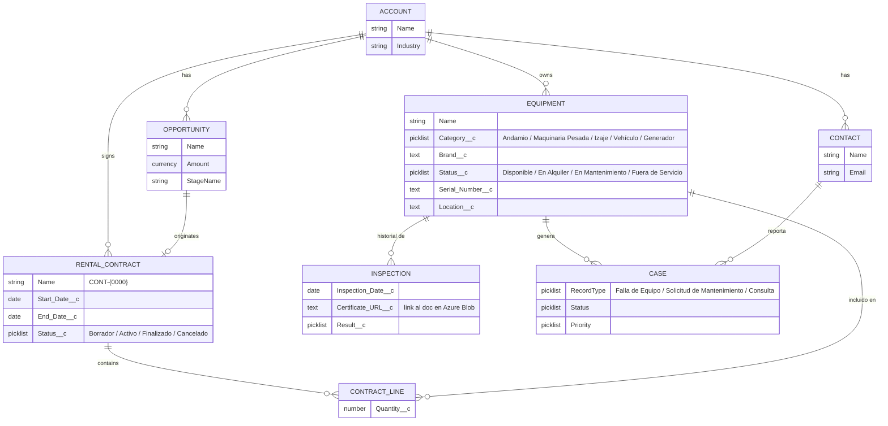

# MineOps360

Plataforma de gestión de alquiler y mantenimiento de equipos y maquinaria para proyectos mineros, construida sobre Salesforce (Sales Cloud + Service Cloud + Experience Cloud) con integraciones a un servicio propio en Java.

Proyecto de portafolio compartido, construido en sprints semanales simulados con GitHub, por Jorge Soria y Carlos Soria (experto de mantenimiento de maquinaria minera / agente de ventas de andamios Doka & Layher, en transición a Salesforce Developer).

## 📋 De qué trata

Una empresa minera alquila equipos y maquinaria (andamios, maquinaria pesada, equipos de izaje, vehículos, generadores) a distintas compañías mineras clientes. MineOps360 cubre todo el ciclo:

- **Venta y alquiler** del equipo (Sales Cloud): oportunidades, contratos de alquiler, aprobaciones de descuento.
- **Mantenimiento y soporte** (Service Cloud): reporte de fallas, asignación a técnicos por especialidad, SLA de respuesta, base de conocimiento, consola de atención con dial.
- **Autogestión del cliente** (Experience Cloud): un portal donde cada empresa minera ve solo sus propios equipos y contratos, reporta incidencias y descarga certificados de inspección.
- **Integraciones**: los certificados de inspección se suben/descargan desde un servicio propio en Java conectado a Azure Blob Storage, y las notificaciones críticas de servicio se envían por SMS vía Twilio.

El proyecto está pensado para reflejar el día a día real de un equipo de implementación Salesforce — modelado de datos, seguridad, automatización declarativa, Apex, integraciones — construido en sprints semanales con Pull Requests, revisiones cruzadas, y un pipeline de CI/CD real sobre 3 orgs (CI, QA, PROD).

## 🏗️ Modelo de datos



**Notas del modelo:**
- `Equipment__c` y `Rental_Contract__c` se relacionan con `Account` por Lookup (no Master-Detail) — un equipo o contrato no debería borrarse en cascada si se elimina la cuenta.
- `Contract_Line__c` es un objeto junction (Master-Detail hacia `Rental_Contract__c` y hacia `Equipment__c`), y resuelve la relación many-to-many: un contrato puede incluir varios equipos, y un equipo puede aparecer en varios contratos a lo largo del tiempo.
- `Inspection__c` es Master-Detail de `Equipment__c` — el historial de inspecciones no tiene sentido sin su equipo.
- `Case` usa Record Types para separar "Falla de Equipo", "Solicitud de Mantenimiento" y "Consulta de Contrato", cada uno con su propio Page Layout y proceso de asignación.

## 🔐 Modelo de seguridad

Se modelan 4 roles de negocio reales, cada uno con visibilidad distinta:

| Rol | Ve | No ve |
|---|---|---|
| Vendedor | Sus propias Opportunities y Accounts asignadas | Contratos/equipos de otros vendedores |
| Técnico de mantenimiento | `Equipment__c` e `Inspection__c` de su zona/queue | Datos comerciales (Opportunities, montos) |
| Supervisor | Todo lo de su equipo, vía jerarquía | Datos de otras regiones |
| Cliente externo (Experience Cloud) | Solo sus propios equipos y contratos | Datos de otras empresas mineras |

Capas usadas para lograrlo:
- **Nivel objeto/campo:** Profiles, Permission Sets y Permission Set Groups; Field-Level Security (ej. el Técnico no ve el monto del contrato).
- **Nivel registro:** Organization-Wide Defaults en Private para `Equipment__c` y `Rental_Contract__c`; Role Hierarchy (Supervisor ve lo de su Técnico); Sharing Rules por dueño y por criterio (ej. compartir por zona); Manual Sharing puntual.
- **Nivel externo (Experience Cloud):** Sharing Sets y Share Groups para que cada empresa minera vea solo lo suyo; distinción entre licencia Customer Community y Customer Community Plus; acceso de Guest User vs usuario autenticado.

## ☁️ Alcance funcional por nube

**Sales Cloud** — Validation Rules, Formula Fields, Record-Triggered Flows, Screen Flow de alta de contrato, Approval Process para descuentos, Reports & Dashboards de pipeline.

**Service Cloud** *(en la plataforma aparece como "Agentforce Service" tras el rebrand de Salesforce en 2026 — es solo un cambio de nombre, la funcionalidad es la clásica)* — Case Record Types, Assignment Rules, Queues por especialidad, Omni-Channel, Email-to-Case, Knowledge Base, Entitlements + Milestones para SLA, consola Lightning con Utility Bar (Macros, Quick Text, Open CTI Softphone).

**Experience Cloud** — sitio tipo Customer Account Portal, componentes en Experience Builder para listar equipos y crear casos, un componente LWC embebido.

## 🔌 Arquitectura de integración

```
Salesforce (Apex REST + HTTP Callout, Named Credentials)
        │
        ▼
Servicio Java / Spring Boot  ──────►  Azure Blob Storage (certificados de inspección)
        │
        ▼
Twilio API (SMS al cliente cuando un Case crítico cambia de estado)
```

- **Apex REST Service** expuesto desde Salesforce para que sistemas externos consulten equipos.
- **HTTP Callout** desde Apex (Queueable, para no bloquear al usuario) hacia el servicio Java que sube/descarga certificados de inspección a Azure Blob Storage (nivel gratuito, 5 GB).
- **Named Credentials** para manejar la autenticación hacia el servicio Java sin hardcodear credenciales.
- **Twilio**, vía Apex Callout, para notificar por SMS cuando un Case de falla crítica cambia de estado.

## 🔁 CI/CD Pipeline

3 orgs gratuitas (Trailhead Playgrounds): **CI**, **QA**, **PROD**.

```
feature/xxx → PR a develop → PR a qa (deploy automático a org QA) → Release a main (deploy automático a org PROD)
```

- GitHub Actions con `validate.yml` (valida + corre tests en cada PR), `deploy-qa.yml` y `deploy-prod.yml`.
- Autenticación vía `sfdxAuthUrl` guardado como GitHub Secret por org.
- Gate de cobertura de pruebas Apex (`RunLocalTests`) antes de cada deploy.
- Branch protection en `qa` y `main`: PR obligatorio, 1 aprobación, check en verde.

## 🛠️ Stack tecnológico

Salesforce (Apex, LWC, Flow, SFDX) · Java / Spring Boot · Azure Blob Storage · Twilio API · GitHub Actions · GitHub Projects

## 👥 Roles del equipo

- **Tech Lead / Integraciones:** revisa y aprueba PRs hacia `qa`/`main`, crea los Releases, construye la capa de Apex/integraciones.
- **Desarrollador Junior:** construye cada feature declarativa primero (modelo de datos, automatización, seguridad), abre PRs contra `develop`.
