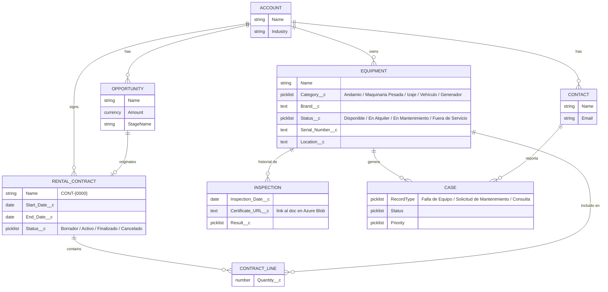

# Modelo de datos

## Notas del modelo

- `Equipment__c` y `Rental_Contract__c` se relacionan con `Account` por Lookup (no Master-Detail) — un equipo o contrato no debería borrarse en cascada si se elimina la cuenta.
- `Contract_Line__c` es un objeto junction (Master-Detail hacia `Rental_Contract__c` y hacia `Equipment__c`), y resuelve la relación many-to-many: un contrato puede incluir varios equipos, y un equipo puede aparecer en varios contratos a lo largo del tiempo.
- `Inspection__c` es Master-Detail de `Equipment__c` — el historial de inspecciones no tiene sentido sin su equipo.
- `Case` usa Record Types para separar "Falla de Equipo", "Solicitud de Mantenimiento" y "Consulta de Contrato", cada uno con su propio Page Layout y proceso de asignación.
